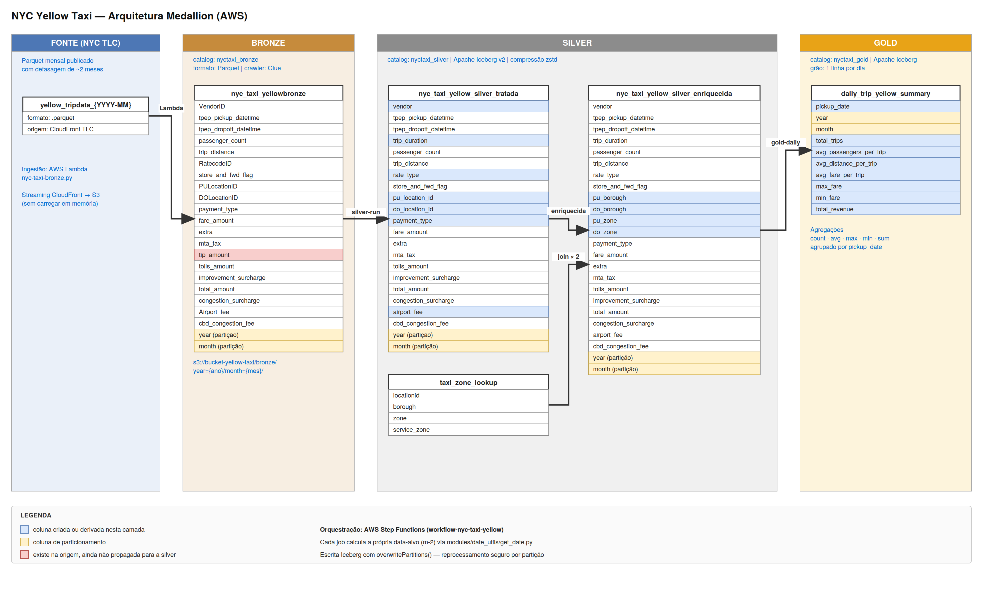

# NYC Yellow Taxi Trips

Pipeline de dados na AWS que processa os registros públicos de corridas de táxi amarelo de Nova York, publicados pela NYC Taxi & Limousine Commission (TLC).

Os dados brutos chegam como arquivos Parquet mensais e passam por três camadas até virarem tabelas prontas para análise. É um projeto de estudo, construído para aprender engenharia de dados na AWS na prática — mas o pipeline funciona de ponta a ponta.

## Arquitetura

O projeto segue a arquitetura medallion, com três camadas:

**Bronze** — dado cru, exatamente como veio da TLC. Uma função Lambda baixa o Parquet do mês e grava no S3 sem transformar nada. A ideia é ter sempre a fonte original preservada, caso algo dê errado camadas acima.

**Silver** — dado limpo e legível. Aqui os códigos numéricos viram texto (`VendorID = 1` vira `"Creative Mobile Technologies, LLC"`), a duração da corrida é calculada, e as colunas ganham nomes padronizados. Depois um segundo job cruza as corridas com a tabela de zonas da cidade, para saber de qual bairro cada viagem saiu e onde terminou.

**Gold** — dado agregado, pronto para consumo. Um resumo diário com total de corridas, médias de distância e tarifa, e faturamento do dia.

Cada camada grava em tabelas Apache Iceberg no S3, registradas no Glue Data Catalog e consultáveis via Athena. A orquestração fica por conta do Step Functions.



## Stack

- **AWS Lambda** — ingestão dos arquivos da TLC
- **AWS Glue 5.0 (PySpark / Spark 3.5)** — transformações
- **Apache Iceberg** — formato das tabelas
- **Amazon S3** — armazenamento (`bucket-yellow-taxi`)
- **AWS Glue Data Catalog** — catálogo de metadados
- **Amazon Athena** — consultas SQL
- **AWS Step Functions** — orquestração

## Estrutura do repositório

```
├── modules/
│   └── date_utils/
│       └── get_date.py                          # cálculo da data-alvo (m-2)
├── transformers/
│   ├── bronze/
│   │   └── nyc-taxi-bronze.py                   # Lambda de ingestão
│   ├── silver/
│   │   ├── nyc-taxi-silver-run.py               # limpeza e decodificação
│   │   └── nyc-taxi-silver-enriquecida-run.py   # join com zonas da cidade
│   └── gold/
│       └── nyc-taxi-gold-daily_trip-run.py      # agregação diária
└── test/
    └── test_silver_run.py                       # teste unitário da silver
```

### O que cada arquivo faz

**`modules/date_utils/get_date.py`**
Uma função só: descobrir qual mês processar. A TLC publica os dados com atraso, então o pipeline sempre trabalha com o mês `m-2` — em julho de 2026, processa maio de 2026. A função também trata a virada de ano (em janeiro, `m-2` é novembro do ano anterior). Os três jobs Glue importam daqui, para que todos concordem sobre qual mês é o alvo.

**`transformers/bronze/nyc-taxi-bronze.py`**
A função Lambda que faz a ingestão. Monta a URL do arquivo Parquet no CloudFront da TLC, faz o download e envia direto para o S3 via streaming — o arquivo nunca é carregado inteiro na memória, o que importa porque a Lambda tem limite apertado. Grava em particionamento Hive (`bronze/year=2026/month=05/`), que é o formato que o crawler do Glue entende.

Por padrão ela calcula o mês sozinha, mas aceita um override no evento para backfill:

```json
{ "date": "2025-11" }
```

**`transformers/silver/nyc-taxi-silver-run.py`**
Lê a tabela bronze, filtra o mês-alvo e transforma. Traduz os códigos de vendor, tipo de tarifa e forma de pagamento para texto legível, calcula a duração da corrida em minutos e renomeia colunas para o padrão `snake_case`. Escreve com `overwritePartitions()`, o que significa que rodar de novo sobrescreve apenas a partição daquele mês — reprocessar é seguro e não destrói o histórico.

A lógica de transformação vive na função `transform_silver()`, separada da configuração do Spark, justamente para poder ser testada sem subir um job Glue.

**`transformers/silver/nyc-taxi-silver-enriquecida-run.py`**
Pega a silver e faz dois joins com a tabela de zonas (`taxi_zone_lookup`): um para o local de embarque, outro para o de desembarque. O resultado tem bairro e nome da zona de origem e destino, o que abre espaço para análises geográficas que a tabela crua não permitia.

**`transformers/gold/nyc-taxi-gold-daily_trip-run.py`**
Agrupa a silver enriquecida por dia e calcula as métricas: total de corridas, média de passageiros, distância e tarifa, tarifa máxima e mínima, e faturamento total do dia. É a tabela que um dashboard consumiria.

**`test/test_silver_run.py`**
Teste unitário com pytest rodando Spark local. Verifica que a decodificação do vendor funciona e que o filtro de período descarta os registros de outros meses. Como os scripts têm hífen no nome (que não é identificador Python válido), o teste importa o módulo manualmente via `importlib`. E como o pacote `awsglue` só existe dentro do runtime do Glue, o teste cria stubs mínimos dele para conseguir importar o script na máquina local.

## Rodando os testes

```bash
pip install pytest pyspark
pytest test/
```

## Fluxo de execução

```
Lambda (bronze)  →  Crawler  →  Glue: silver  →  Glue: silver enriquecida  →  Glue: gold
```

Cada etapa calcula sua própria data-alvo em vez de receber essa informação da anterior. É uma escolha deliberada: cada job pode ser executado isoladamente, sem depender do orquestrador para saber o que processar.